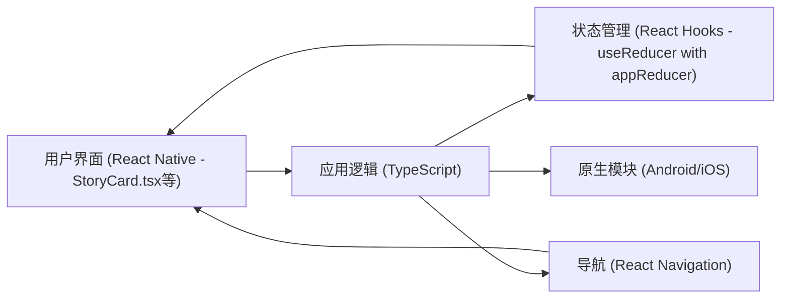

# 系统模式

## 系统架构

根据 `README.md` 的描述，本应用是一个基于 **React Native** 构建的移动应用程序，目标平台为 **Android** 和 **iOS**。

- **状态管理核心**: `MyAppState.ts` 定义全局状态结构，`reducer.ts` 中的 `appReducer` 负责处理所有状态变更。引入 `currentCheckAttempt` 状态来管理多阶段检定流程。

## 关键技术决策

- **跨平台开发**：选择 React Native 以便同时支持 Android 和 iOS，复用代码库。
- **强类型语言**：使用 TypeScript 来增强代码的可维护性和减少运行时错误。
- **状态管理**：采用 React Hooks (`useReducer`) 实现类似 Redux 模式的本地化状态管理。`MyAppState.ts` 定义了全局应用状态，`appReducer` (`reducer.ts`) 集中处理状态变更逻辑。
- **导航**：使用 React Navigation 进行页面间的导航。
- **原生性能优化**：通过 `react-native-screens` 将非原生的导航容器转换为原生容器，提升导航性能。
- **动画**：使用 `react-native-reanimated` 实现流畅的动画效果。

## 设计模式

- **状态机模式**: 在 `reducer.ts` 中通过 `currentCheckAttempt` 状态管理检定流程（如：等待检定 -> 显示检定结果 -> 等待用户确认 -> 解析结果并跳转）。
- **组件化模式**: UI 通过可复用组件（如 `StoryCard.tsx`）构建。
  （在项目开发过程中，根据实际应用的设计模式进行补充，例如：容器/展示组件模式等。）

## 组件关系

- **`StoryCard.tsx`**: 核心UI组件，负责展示当前场景的剧情文本、选项和检定信息。根据 `MyAppState.currentCheckAttempt` 的状态，动态调整显示内容以支持多阶段检定流程。用户交互（选择选项、执行检定）会通过 `dispatch` 触发 `appReducer` 中的相应action。
  （在项目开发过程中，根据核心组件的实现进行补充，例如：角色信息组件、选项按钮组件等之间的关系。）

## 关键实现路径

1.  **数据结构定义与转换**：
    - 在 `src/interface/` 目录下定义详细的TypeScript接口（`Scene.ts`, `enums.ts`, `MyAppState.ts`），描述游戏场景、选项、条件、检定、效果等。
    - 将 PDF 格式的剧本（中文和英文）转换为此结构化的 JSON 数据格式 (存放于 `src/data/`)，作为应用的内容源。
2.  **游戏主体与检定流程实现**：
    - 在 `StoryCard.tsx` 中实现剧情卡片的展示。
    - 根据新的多阶段检定流程处理交互逻辑：
      1.  UI显示检定提示。
      2.  用户点击触发检定 (`PERFORM_SCENE_CHECK` 或 `PERFORM_OPTION_CHECK` action)。
      3.  `appReducer` 执行检定（初步实现 `executeCheckLogic`），并将掷骰值、结果、后续选项存入 `currentCheckAttempt` 状态。
      4.  UI根据 `currentCheckAttempt` 更新，显示检定结果和唯一的后续操作选项。
      5.  用户点击该选项，触发 `RESOLVE_CHECK_OUTCOME` action。
      6.  `appReducer` 应用效果并跳转到目标场景，清空 `currentCheckAttempt`。
3.  **角色系统**：
    - 初期使用 Fake 数据 (`FakerCharacter()`) 初始化 `characterData` 状态。
    - 后续需根据剧情交互（尤其是在角色创建相关的场景中）实际更新 `characterData`。
    - 实现角色属性的查看和管理界面。
4.  **规则判定逻辑完善**:
    - 在 `reducer.ts` 中，完整实现 `executeCheckLogic` 函数，使其能根据 `characterData` 中的真实技能/属性值进行检定，并处理奖励/惩罚骰。
    - 完整实现 `applySingleEffect` 和 `applyAllEffects` 函数，以支持所有 `EffectType`，包括解析如 "1D3" 的字符串值来改变HP/Sanity，管理物品和游戏标记。
5.  **用户界面**：
    - 设计和实现主界面、前言界面、结局总结页面。
    - 实现角色信息浮动卡片的展示。

## 源代码目录结构 (来自 README.md 及当前调整)

- `android` 安卓原生代码
- `ios` iOS 原生代码
- `src` JS 源代码
  - `App.tsx` 应用主界面
  - `hook.ts` 通用的 react-hook (`useAppReducer`)
  - `reducer.ts` 应用状态管理逻辑 (`appReducer`)
  - `ui/` 界面相关代码
    - `components/` 可复用的组件 (如 `StoryCard.tsx`)
  - `interface/` TypeScript 类型定义
    - `Scene.ts` (场景、选项、检定、效果等核心游戏逻辑接口)
    - `MyAppState.ts` (全局应用状态及Action定义)
    - `enums.ts` (游戏内使用的各种枚举，如检定对象、效果类型)
    - `Character.ts` (角色数据结构)
  - `data/` 转换后的剧本数据
    - `SceneData_CN.ts` (中文剧本数据)
    - `SceneData_EN.ts` (英文剧本数据，待填充)
  - `images/` 图片、Icon 资源
  - `theme/` 通用样式、颜色定义 (`padding.ts`, `palette.ts`, `typeface.ts`)
- `index.js` 入口文件
