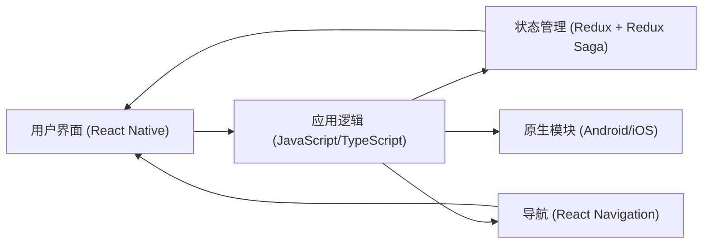

# 系统模式

## 系统架构

根据 `README.md` 的描述，本应用是一个基于 **React Native** 构建的移动应用程序，目标平台为 **Android** 和 **iOS**。

## 关键技术决策

- **跨平台开发**：选择 React Native 以便同时支持 Android 和 iOS，复用代码库。
- **强类型语言**：使用 TypeScript 来增强代码的可维护性和减少运行时错误。
- **状态管理**：采用 React Redux 进行应用状态管理，配合 Redux Saga 处理异步操作和副作用。
- **导航**：使用 React Navigation 进行页面间的导航。
- **原生性能优化**：通过 `react-native-screens` 将非原生的导航容器转换为原生容器，提升导航性能。
- **动画**：使用 `react-native-reanimated` 实现流畅的动画效果。

## 设计模式

（在项目开发过程中，根据实际应用的设计模式进行补充，例如：组件化模式、容器/展示组件模式等。）

## 组件关系

（在项目开发过程中，根据核心组件的实现进行补充，例如：剧情卡片组件、角色信息组件、选项按钮组件等之间的关系。）

## 关键实现路径

1.  **数据转换**：将 PDF 格式的剧本（中文和英文）转换为 JSON 数据格式，作为应用的内容源。
2.  **游戏主体实现**：
    - 实现剧情卡片的展示和交互逻辑。
    - 实现基于卡片编号或选项的跳转逻辑。
3.  **角色系统**：
    - 初期使用 Fake 数据展示角色卡。
    - 后续根据剧情交互生成真实的角色数据。
    - 实现角色属性的查看和管理。
4.  **规则判定**：
    - 实现全局的投骰子功能。
    - 基于投骰子实现《克苏鲁的呼唤》第七版规则中定义的判定能力，并集成到游戏流程中。
5.  **用户界面**：
    - 设计和实现主界面、前言界面、剧情卡片界面、结局总结页面。
    - 实现角色信息浮动卡片的展示。

## 源代码目录结构 (来自 README.md)

- `android` 安卓原生代码
- `ios` iOS 原生代码
- `src` JS 源代码
  - `App.tsx` 应用主界面
  - `hook.ts` 通用的 react-hook
  - `reducer.ts` 应用 redux 状态树定义，以及一些通用的 redux 状态容器定义
  - `ui` 界面相关代码
    - `components` 可复用的组件
  - `interface` 数据类型和解析器定义
  - `images` 图片、Icon 资源
  - `themes` 通用样式、颜色定义，包括日间和夜间两套
- `index.js` 入口文件
